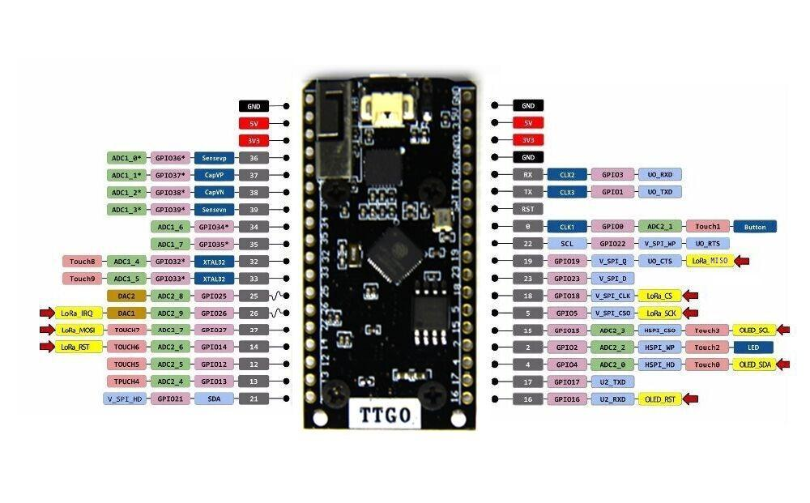

# ESP32 OLED LoRa TTGO LoRa32 Board

Retrieved: 2026-05-01

Sources:
- [TinyTronics — LilyGO TTGO LoRa32 868MHz ESP32](https://www.tinytronics.nl/en/lilygo-ttgo-lora32-868mhz-esp32)
- [PrimalCortex — The ESP32 OLED LoRa TTGO LoRa32 Board and Connecting it to TTN](https://primalcortex.wordpress.com/2017/11/24/the-esp32-oled-lora-ttgo-lora32-board-and-connecting-it-to-ttn/)
- [Xinyuan-LilyGO/TTGO-LoRa-Series (GitHub)](https://github.com/Xinyuan-LilyGO/TTGO-LoRa-Series)

---

## Description

The LilyGO TTGO LoRa32 is a compact development board that integrates an ESP32 microcontroller, an SX1276 LoRa radio, and a 0.96-inch OLED display on a single PCB. It is designed for IoT prototyping — particularly for LoRaWAN applications such as connecting to The Things Network (TTN) — and can be powered from USB or a LiPo/Li-ion battery via the onboard charging circuit.

> **Note:** The OLED displays on the workshop boards are burned-in and no longer functional.

---

## Specifications

### Processor

| Parameter | Value |
|---|---|
| Chip | ESP32 |
| CPU | 240 MHz dual-core Xtensa LX6 |
| Flash memory | 4 MB |

### Wireless

| Interface | Details |
|---|---|
| WiFi | 802.11 b/g/n (2.4 GHz), integrated antenna (bent-metal on back of board) |
| Bluetooth | Classic and BLE |
| LoRa | SX1276 transceiver, 868 MHz (EU band) |
| LoRa antenna connector | U.FL / IPEX |

### Display

| Parameter | Value |
|---|---|
| Type | OLED, 0.96 inch |
| Driver | SSD1306 |
| Interface | I2C |
| I2C address | `0x3C` |

### Power

| Parameter | Value |
|---|---|
| Supply | Micro USB or LiPo/Li-ion battery |
| Battery connector | 2-pin Molex PicoBlade |
| Charging IC | TP4054 |
| Charge current | Up to 500 mA |
| Logic voltage | 3.3 V (all GPIO pins — not 5 V tolerant) |

### USB / Serial

| Parameter | Value |
|---|---|
| Chip | CP2102 or CH9102F (varies by board version) |
| Connector | Micro USB |

### Indicators

| LED | Pin | Description |
|---|---|---|
| Blue | GPIO 2 | User-controllable |
| Red | — | Power indicator (dim) |

---

## Pin Assignment by Board Version

Pin assignments differ between hardware revisions. Always verify against your physical board.

| Signal | V1.0 | V1.2 (T-Fox) | V1.6 | V2.0 |
|---|---|---|---|---|
| OLED RST | 16 | N/A | N/A | N/A |
| OLED SDA | 4 | 21 | 21 | 21 |
| OLED SCL | 15 | 22 | 22 | 22 |
| SD Card CS | N/A | N/A | 13 | 13 |
| SD Card MOSI | N/A | N/A | 15 | 15 |
| SD Card MISO | N/A | N/A | 2 | 2 |
| SD Card SCLK | N/A | N/A | 14 | 14 |
| DS3231 SDA | N/A | 21 | N/A | N/A |
| DS3231 SCL | N/A | 22 | N/A | N/A |
| LoRa MOSI | 27 | 27 | 27 | 27 |
| LoRa MISO | 19 | 19 | 19 | 19 |
| LoRa SCLK | 5 | 5 | 5 | 5 |
| LoRa CS (NSS) | 18 | 18 | 18 | 18 |
| LoRa RST | 14 | 23 | 23 | 23 |
| LoRa DIO0 | 26 | 26 | 26 | 26 |

### Additional pins (V1.0, from PrimalCortex)

| Signal | GPIO |
|---|---|
| LoRa DIO1 | 33 |
| LoRa DIO2 | 32 |

---

## Pinout Diagram



> Earlier pinout diagrams contain errors. The image above is the corrected version (v2). See [`ttgo-lora32-ttn.md`](ttgo-lora32-ttn.md) for the original incorrect diagram kept for reference.

---

## Programming

### Arduino IDE

Select **ESP32 Dev Module** in the board manager.

### PlatformIO

Use the `heltec_wifi_lora_32` board target:

```ini
[env:heltec_wifi_lora_32]
platform = espressif32
board = heltec_wifi_lora_32
framework = arduino
lib_deps = 852, 562
```

| Library | PlatformIO ID |
|---|---|
| ESP8266_SSD1306 (OLED driver) | 562 |
| IBM LMIC (LoRaWAN stack) | 852 |

Alternatively, for the arduino-LoRa library approach:
- [arduino-LoRa](https://github.com/sandeepmistry/arduino-LoRa)
- [esp8266-oled-ssd1306](https://github.com/ThingPulse/esp8266-oled-ssd1306)

---

## LMIC Pin Mapping (V1.0)

For use with the IBM LMIC LoRaWAN library on board version V1.0:

```c
const lmic_pinmap lmic_pins = {
    .nss  = 18,
    .rxtx = LMIC_UNUSED_PIN,
    .rst  = 14,
    .dio  = {26, 33, 32}
};
```

---

## Known Issues

| Issue | Detail |
|---|---|
| 3.3 V only | All GPIO pins are connected directly to the ESP32 and are not 5 V tolerant |
| USB3 compatibility | Connecting to a USB3 port may fail under Linux; use a USB2 port instead |
| Serial chip variants | Board ships with either CP2102 or CH9102F — install the correct driver |
| Board variants | Multiple hardware revisions exist with different pinouts — verify before use |
| WiFi antenna | On-board WiFi antenna performance is noted as weak |
| OLED burn-in | The OLED displays on the workshop boards are burned-in and no longer functional |

---

## Package Contents

- 1× LilyGO TTGO LoRa32 v1.0 board
- 1× LoRa antenna 868 MHz
- 1× Battery cable with 2-pin Molex PicoBlade connector
- 2× 18-pin male header

---

## Related Documentation

| File | Description |
|---|---|
| [`ttgo-lora32-ttn.md`](ttgo-lora32-ttn.md) | Full archived article: connecting the board to TTN with LMIC and Node-RED |
| [`LilyGO_TTGO_LoRa32_868MHz_ESP32.md`](LilyGO_TTGO_LoRa32_868MHz_ESP32.md) | Product page notes from TinyTronics |
| [`TTGO-LoRa-Series-master/`](TTGO-LoRa-Series-master/) | Official LilyGO sample code repository (local copy) |
