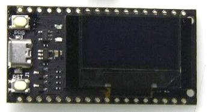
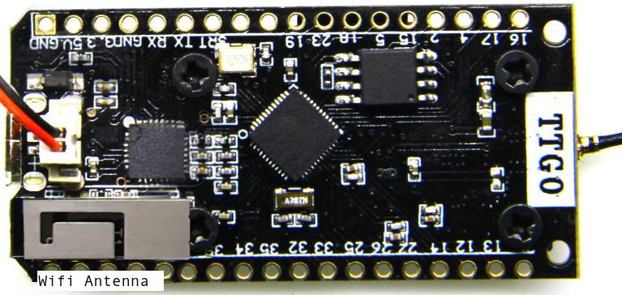
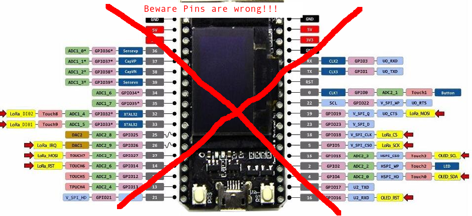
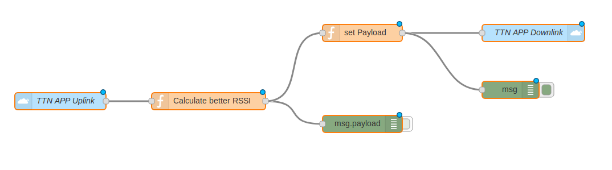

# The ESP32 OLED LoRa TTGO LoRa32 Board and Connecting it to TTN

> **Source:** [primalcortex.wordpress.com](https://primalcortex.wordpress.com/2017/11/24/the-esp32-oled-lora-ttgo-lora32-board-and-connecting-it-to-ttn/)  
> **Author:** PrimalCortex  
> **Published:** 24 November 2017  
> **Archived:** 2026-05-01

---

## Board Overview

The TTGO LoRa32 is an ESP32-based development board that combines an OLED display and a LoRa transceiver on a single compact PCB. It is well suited for IoT prototyping with The Things Network (TTN).

**Key features:**

- ESP32 processor with integrated WiFi and Bluetooth
- SSD1306 OLED display (I2C address `0x3C`)
- SX1276 LoRa transceiver — 868 MHz variant
- U.FL/IPEX connector for LoRa antenna
- Bent-metal "3D" WiFi antenna on the back of the board
- LiPo battery connector with onboard charging circuit
- User-controllable blue LED on **Pin 2**
- Dim red power LED
- I2C bus: **SDA pin 4**, **SCL pin 15**





---

## Pinout Diagram

> **Note:** An earlier pinout diagram contained errors and was corrected after reader feedback. The corrected version is shown below. Multiple board revisions exist — always verify pin assignments against your physical hardware.

**Original (incorrect) pinout — kept for reference:**



**Corrected pinout (v2):**


---

## LMIC Pin Mapping

For use with the IBM LMIC library the following pin mapping applies:

```c
const lmic_pinmap lmic_pins = {
    .nss = 18,
    .rxtx = LMIC_UNUSED_PIN,
    .rst = 14,
    .dio = {26, 33, 32}
};
```

- LoRa `DIO0` → GPIO 26  
- LoRa `DIO1` → GPIO 33  
- LoRa `DIO2` → GPIO 32  

---

## Programming Environment

The board is programmed using **PlatformIO** with the Heltec WiFi LoRa 32 board target.

**`platformio.ini`:**

```ini
[env:heltec_wifi_lora_32]
platform = espressif32
board = heltec_wifi_lora_32
framework = arduino
lib_deps = 852, 562
```

**Required libraries:**

| Library | PlatformIO ID |
|---|---|
| ESP8266_SSD1306 (OLED driver) | 562 |
| IBM LMIC (LoRaWAN stack) | 852 |

---

## Connecting to The Things Network (TTN)

The article demonstrates sending uplink packets to TTN and receiving downlink responses. A Node-RED backend calculates the best RSSI and SNR from all gateways that received the uplink, then sends the RSSI value back as a downlink message. The board displays the received value on the OLED.

**Partial event handler showing downlink reception:**

```c
void onEvent (ev_t ev) {
    if (ev == EV_TXCOMPLETE) {
        // Check for ACK and received downlink data
        if (LMIC.dataLen) {
            for (int i = 0; i < LMIC.dataLen; i++)
                TTN_response[i] = LMIC.frame[LMIC.dataBeg + i];
            display.drawString(0, 32, String(TTN_response));
        }
    }
}
```

Sample OLED output: `Data Received: RSSI: -118`

**Node-RED flow:**



---

## Known Issues and Notes

| Issue | Detail |
|---|---|
| USB3 compatibility | Connecting to a USB3 port may fail under Linux; use a USB2 port instead |
| Serial chip | Unmarked CP210x (Cygnal CP2102/CP2109) UART bridge controller |
| ESP32 silicon revision | Board tested uses Revision 1 (latest at time of publication) |
| WiFi antenna | Performance noted as weak |
| Board variants | Multiple hardware revisions exist with different pinouts — verify before use |

---

## Sample Code

Full source code for the TTN uplink/downlink example:  
[https://github.com/fcgdam/TTGO_LoRa32](https://github.com/fcgdam/TTGO_LoRa32)
